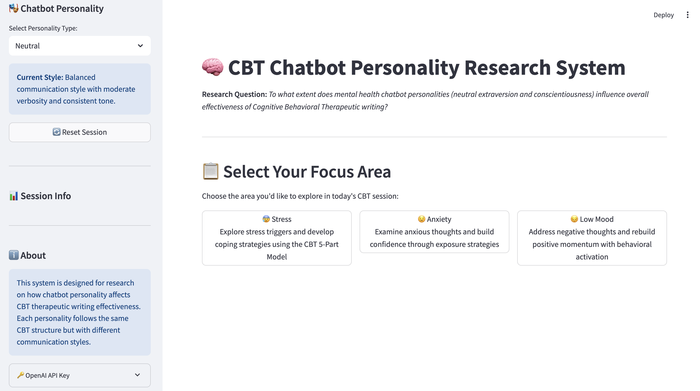

## Level4IndividualProject_Final

CBT Writing Chatbot
A research product to evaluate how chatbot personality types influence the effectiveness of Cognitive Behavioral Therapeutic (CBT) writing interventions.

Research Question
"To what extent does mental health chatbot personalities (neutral, extraversion and conscientiousness) influence overall effectiveness of Cognitive Behavioral Therapeutic writing?"
## Overview
This system implements three distinct chatbot personalities based on the Big Five personality model:

Neutral: Balanced communication style with moderate engagement
Conscientiousness: Structured, detailed, achievement-oriented responses
Extraversion: Enthusiastic, energetic, socially-focused communication

Each personality guides users through evidence-based CBT interventions for stress, anxiety, and low mood while maintaining consistent therapeutic content.

Core Functionality
Three Personality Types: Neutral, Conscientiousness, Extraversion
Three CBT Conditions: Stress (35 questions), Anxiety (31 questions), Low Mood (30 questions)
Structured CBT Flows: Following 5-Part CBT Model (Situation, Thoughts, Emotions, Behaviors, Physical Reactions)
Real-time Chat Interface: Interactive conversation flow using Streamlit's chat components with personality-driven responses generated through OpenAI GPT-3.5-turbo integration or local template fallback, maintaining conversation history and providing immediate feedback.
Progress Tracking: Visual progress bars showing session completion status (current step / total questions), real-time analytics including response count, average response length, and engagement scoring displayed in the sidebar interface.

## Visuals

The main application interface showing the personality selector (Neutral selected), three CBT focus areas (Stress, Anxiety, Low Mood), and research information sidebar.

Key Interface Features

- Personality Selection: Dropdown to choose between Neutral, High Conscientiousness, and High Extraversion
- Focus Area Selection: Three mental health conditions with clear descriptions
- Session Management: Reset functionality and progress tracking
- Research Integration: Built-in information about the study purpose and methodology
- OpenAI Integration: Optional API key configuration for enhanced responses

## Installation
This CBT writing chatbot system is built with Python and Streamlit, which are designed to work across multiple operating systems. However, while Python and Streamlit are generally cross-platform compatible, this specific implementation has primarily been developed and tested in a specific environment. Users on different operating systems may encounter variations in setup or functionality. The system has been tested on Python 3.8+ and requires minimal dependencies, with optional OpenAI API integration for enhanced personality responses.

Requirements

System Requirements:
Python 3.8 or higher (recommended: Python 3.9+)
At least 2GB of available RAM
Internet connection for OpenAI API integration (optional)
Modern web browser (tested on Chrome and Safari)

Required Python Packages:
streamlit (web application framework)
openai (OpenAI API integration)
textblob (natural language processing)
pandas (data analysis and export)

Optional Requirements:
OpenAI API key (for enhanced GPT-powered personality responses)
Git (for repository cloning)

Note on Compatibility: While the underlying technologies (Python, Streamlit) support multiple operating systems, this specific implementation has been developed primarily for academic research purposes. Browser compatibility has been verified on Chrome and Safari. If you encounter platform-specific or browser-specific issues, please refer to the troubleshooting section or contact the project maintainer.

## Usage

To start a CBT session is to launch the application and select your personality:
bashstreamlit run app_simple.py
![Expect output] (images/conscientiousness.png) 
When you select "Conscientiousness" personality and choose "Anxiety" condition:
![Expect output] (images/anxietyarea.png)

## Support

## Troubleshooting

### Common Issues and Solutions

#### Personality Color Schemes Not Displaying
**Issue**: The chatbot interface doesn't show the personality-specific color schemes (gray for Neutral, blue for Conscientiousness, orange for Extraversion).

**Root Cause**: CSS styles were defined but not properly applied to Streamlit's chat interface components.

**Solution**: This has been fixed in the latest version. The system now:
- Loads custom CSS automatically on startup
- Uses JavaScript to dynamically apply `data-personality` attributes to the main app container
- Applies personality-specific styling to chat messages, headers, progress bars, and sidebar

**Colors by Personality**:
- **Neutral**: Gray color scheme (#6b7280)
- **Conscientiousness**: Professional blue color scheme (#1d4ed8) 
- **Extraversion**: Energetic orange color scheme (#ea580c)

If colors still don't appear:
1. Refresh the browser page
2. Clear browser cache
3. Ensure JavaScript is enabled in your browser
4. Check browser console for any errors

#### Chat Messages Not Styling Correctly
**Issue**: Chat messages appear with default Streamlit styling instead of personality colors.

**Solution**: The system now uses CSS selectors targeting Streamlit's chat components with `data-testid` attributes and applies styling based on the `data-personality` attribute on the main app container.

#### Slow Color Updates When Switching Personalities
**Issue**: Color scheme takes time to update when switching between personalities.

**Solution**: The system now includes multiple JavaScript triggers:
- Immediate update on personality selection
- DOM change detection with delays
- Page load handlers for initial setup

## Support

For assistance with this CBT chatbot research system, support is available through multiple channels depending on your needs:
Technical Issues & Bug Reports: If you encounter technical problems, installation difficulties, or software bugs, please create an issue in the GitLab repository with detailed descriptions of the problem, error messages, and steps to reproduce the issue.
Research Inquiries & Academic Collaboration: For questions about the research methodology, data collection procedures, or potential academic collaboration, please contact the principal investigator directly via email at [2613092l@student.gla.ac.uk]. Include "CBT Writing Chatbot Research" in the subject line for prompt response.
Usage Support & Documentation: If you need help understanding how to use the system, configure personality settings, or interpret the CBT sessions, refer to the comprehensive documentation sections in this README.
Mental Health Resources: This system is designed for research purposes only and should not replace professional mental health support. If you are experiencing mental health difficulties, please contact qualified mental health professionals, your local GP, or crisis support services such as Samaritans (116 123) or NHS 111.
University Support: As this is a Level 4 Individual Project at the University of Glasgow, academic supervision and project oversight are provided through the School of Computing Science. For formal academic inquiries related to this research, please contact the university through appropriate academic channels.

## License
This research system is provided for academic and research purposes. Please cite appropriately in research publications.

Acknowledgments
Built for Computing Science individual project research on chatbot personality influence in CBT therapeutic writing effectiveness.

Research Ethics Note: This system is designed for research purposes and is not a substitute for professional mental health treatment. Participants experiencing distress should be directed to appropriate mental health resources.